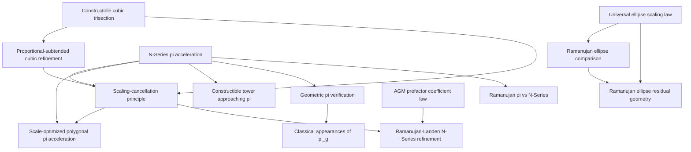

# Dependency and Citation Graph

## Citation principles

- The angle-division papers should not cite polygonal N-Series cancellation as
  though it were the same convergence mechanism.
- The N-Series papers may cite Richardson/Romberg for the algebraic
  extrapolation and identify the geometric contribution separately.
- The Ramanujan and Landen papers must retain the guarded distinction between
  polynomial resolution acceleration and modular or AGM convergence.
- The ellipse residual paper should cite the broader ellipse comparison but
  avoid reproducing its complete numerical survey.
- Verification papers provide evidence and reproducibility; they do not replace
  analytic proofs.
