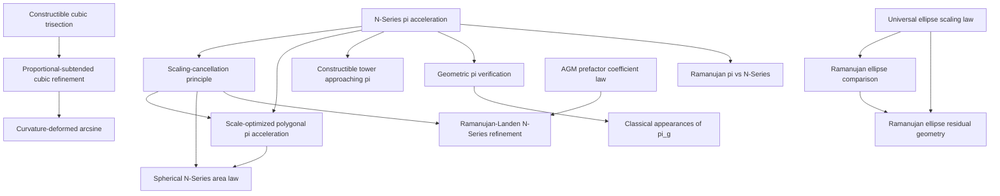

# Dependency and Citation Graph

## Curved-refinement dependency note

The curvature-deformed-arcsine paper extends the cubic geometric-refinement line into intrinsic curved-surface geometry. Its analytic development is complete through geometric weight five. The general weight-six side law is supported by high-precision rational reconstruction; an independent analytic degree-eight two-point geodesic-distance derivation remains open.

## Spherical dependency note

The spherical-area paper depends on the general conditional scale-cancellation theorem, but its geometric even-power law remains conjectural outside the tested regular families. Numerical evidence does not replace an analytic proof for arbitrary spherical domains or meshes.

## Citation principles

- Distinguish cubic angular refinement from fixed-resolution scale cancellation.
- Distinguish curved cubic-refinement results from the separate spherical-area N-Series branch.
- Attribute Richardson-Romberg extrapolation as classical arithmetic.
- Treat the spherical 2-4-6-8 ladder as numerical evidence for regular families.
- Do not describe perturbed-mesh diagnostic quotients as stable high-order convergence when the asymptotic regime is unclear.
- Keep the weight-six curvature side-law reconstruction explicitly separate from analytically proved results through weight five.
- Keep Ramanujan, Landen, and AGM comparisons guarded against claims of numerical equivalence.
- Verification repositories support evidence and reproducibility; they do not replace proofs.
